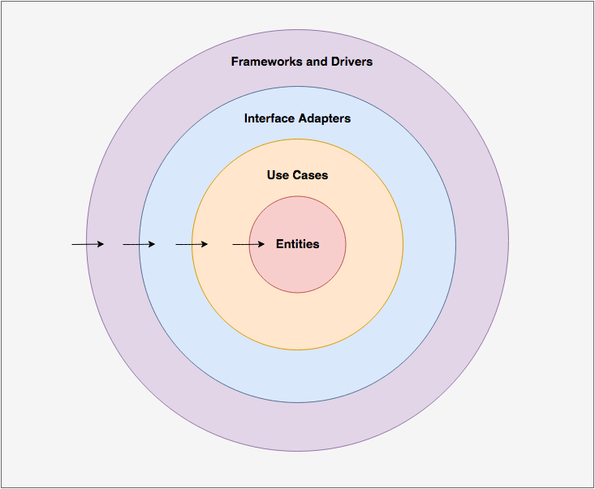

## Entities
- Entities encapsulate the most general and high-level business rules.
They are the least likely to change when something external changes.
- The entities do not depend on any of the other circles.

## Usecase
- The use case layer contains application specific business rules.
- The use case layer only depends on the entities. Change in the entities will require a change in the use case layer, 
but changes to other layers won’t.

## Interface Adapters
- Interface adapters layer contains a set of adapters that convert data from the format most convenient for the use 
cases and entities, to the format most convenient for some external agency such as the Database or the Web.

## Frameworks and Adapters
- This layer is where all the details go: the Web is a detail and so is the database.
- In the Frameworks and Adapters layer we have the Database, UI, etc.
- This is the most external level, and is bound to change more frequently than other circles. However, changes here should not affect inner circles.
